# 自动驾驶工作复盘分享：PPT 页面脚本

说明：本文件按“个人简介 -> 三个心得 -> 展望未来”的结构组织。每页只保留三部分：页标题、页内文字、图表。图表只使用两种形式：Markdown 图片引用，或 Mermaid 代码块。

---

## 第1页 自动驾驶算法发展切面：我的参与与思考

页内文字

- 姓名：陈奕志
- 籍贯：广东
- 学校：上海交大
- 工作年限：7年+
- 上家公司：华为车BU

---

## 第2页 我过去 5 年主要做了什么

页内文字：

- 华为前期：静态环境感知算法与数据闭环建设
- 华为后期：智驾大模型数据系统与团队建设
- 核心能力：算法研发、数据系统

图表：

---

## 第3页 五年，三个心得

图表：

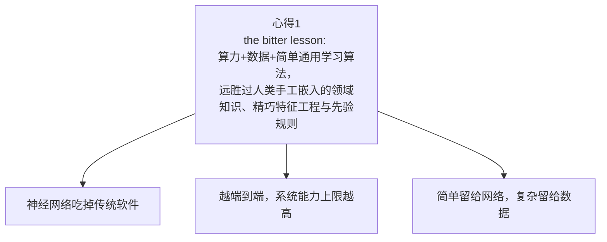

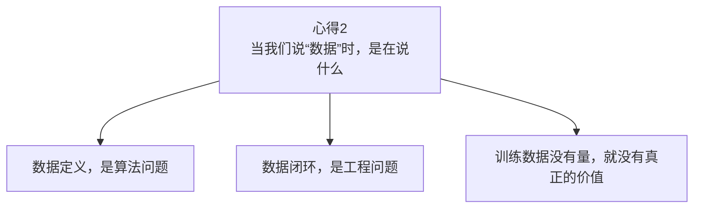

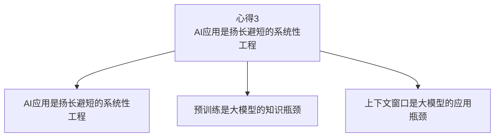

---

## 第4页 心得1：the bitter lesson

页内文字：

- 算力 + 数据 + 简单通用学习算法
- 正在持续吃掉人工规则、特征工程和模块接口

图表：

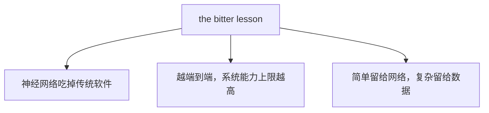

---

## 第5页 心得1-1：神经网络吃掉传统软件

页内文字：

- 2D: 算法各自为战，百万行后处理融合代码才是核心
- 3D: BEV / Occupancy大一统，后处理代码下降1个数量级

图表：

---

## 第6页 心得1-2：越端到端，系统能力上限越高

页内文字：

- 链路越长，接口损失和误差传递越重
- 端到端，把任务重写成统一学习问题

图表：

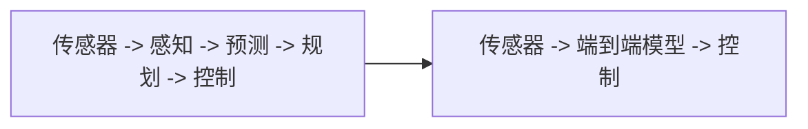

---

## 第7页 心得1-3：简单留给网络，复杂留给数据

页内文字：

- 模型架构更统一、简洁（文本/语音/视觉，分类/回归/生成）
- 但数据规模、团队规模、研发复杂度持续上升
- 以静态感知的数据处理为例：

图表：

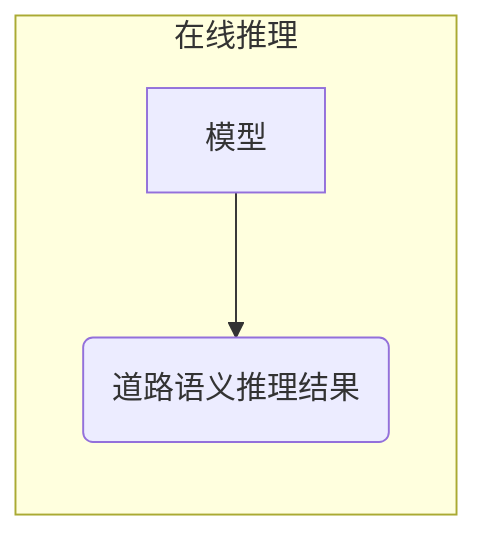

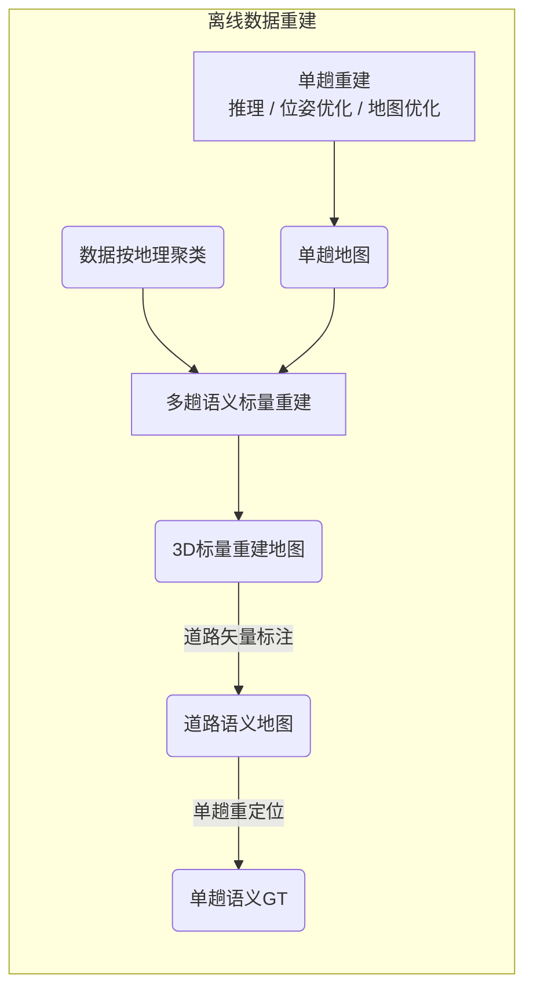

---

## 第8页 心得2：当我们说“数据”时，是在说什么

图表：

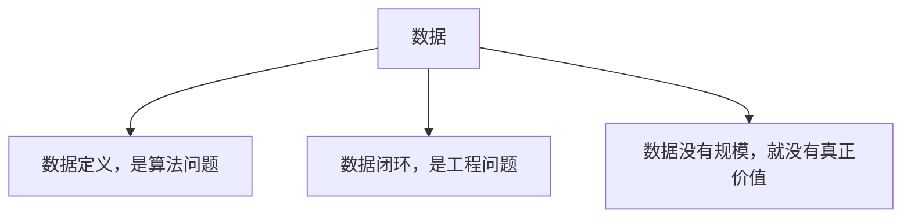

---

## 第9页 心得2-1：数据定义，是算法问题

页内文字：

- 输入输出，定义了"你要达到什么目的"，即任务本身。
- 评测指标，定义了”你认为什么是好的”，即任务的优化目标。
- 抛开这三个谈算法，是无源之水，镜中之月。

图表：

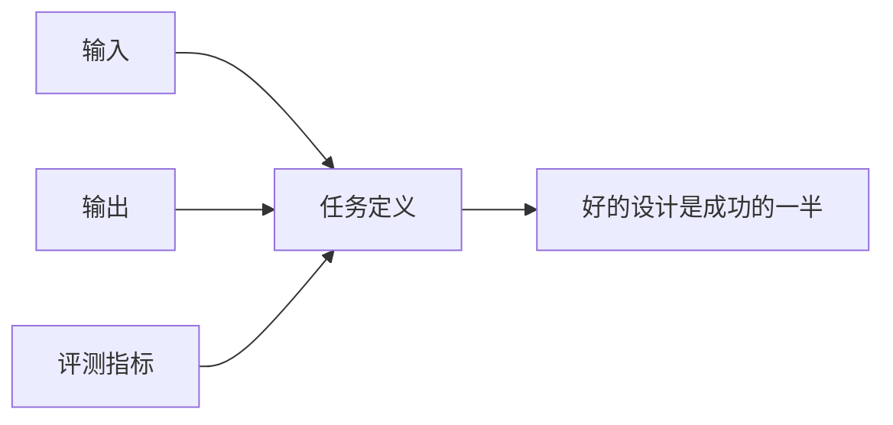

---

## 第10页 心得2-2：数据闭环，是工程问题

页内文字：

- 数据理解：标注、统计、可视化、结构化
- 数据策划：挖掘、采集、合成、平衡
- 人工标注：
  - 质量重于数量. scaleAI/surgeAI标注员时薪可至200美元.
  - 成本高昂
    - 基于不信任的团队管理：规格/产线管理/工艺/质量
    - 基础设施：标注平台，人机共标算法，统计/运维后台

图表：

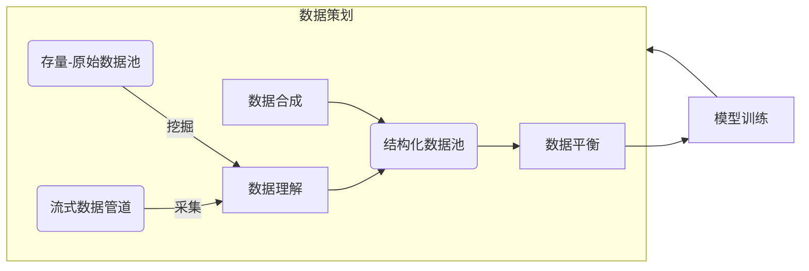

---

## 第11页 心得2-3：训练数据没有量，就没有真正的价值

页内文字：

- 训练数据价值，取决于存储、版本、检索、计算
- 大规模数据资产，决定模型迭代速度
- 我做过版本系统、检索系统、多模态数据仓和自动化产线

图表：

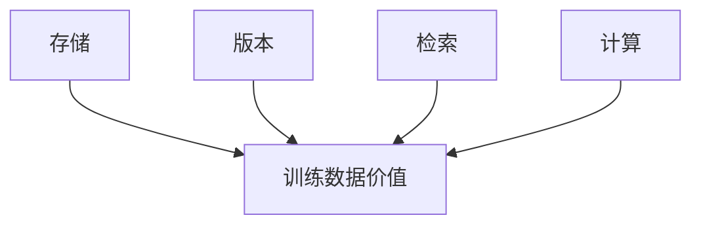

---

## 第12页 心得3：AI应用是系统性工程

页内文字：

- AI 应用的核心不是单点最强，而是系统协同最优
- 大模型时代，这个问题进一步体现为知识瓶颈和上下文瓶颈

图表：

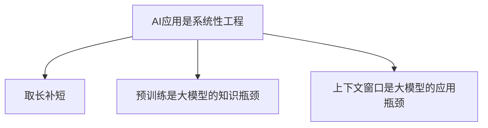

---

## 第13页 心得3-1：取长补短, 系统协同

页内文字：

- 超人模块 + 弱智AI，也能做出可用系统
- 激光雷达和 RoadCode（华为众包高精地图），都是典型例子
- 系统的竞争力，本质来自协同、互助。（算法、组织、生物体都一样）

图表：

---

## 第14页 心得3-2：预训练是大模型的知识瓶颈

页内文字：

- 冷门垂域的微调有用，但瓶颈仍然在预训练
- 业界解垂域手段：大规模数据合成（冷启动：微调/蒸馏/挖掘/...）进预训练，挑选复杂/困难的数据进SFT和RLHF的循环迭代。

图表：

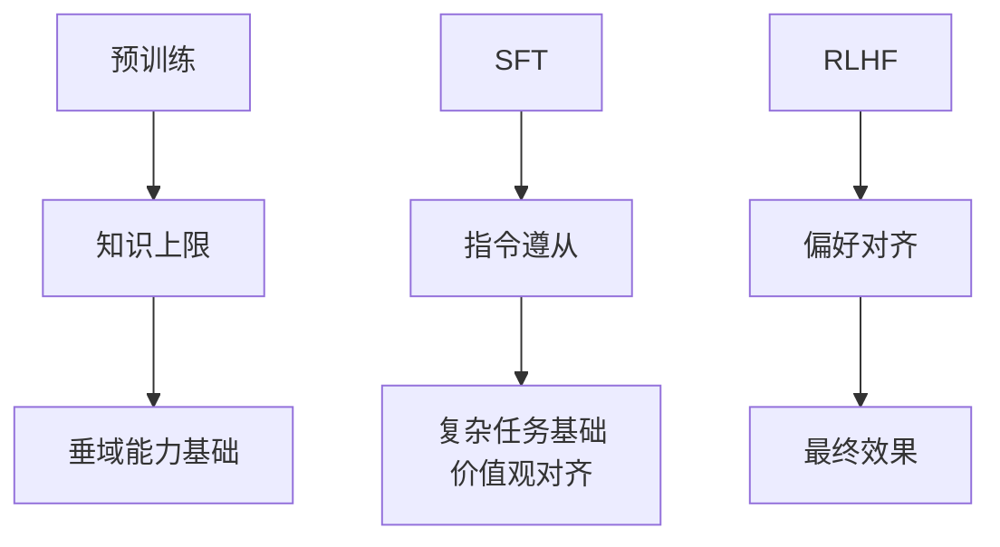

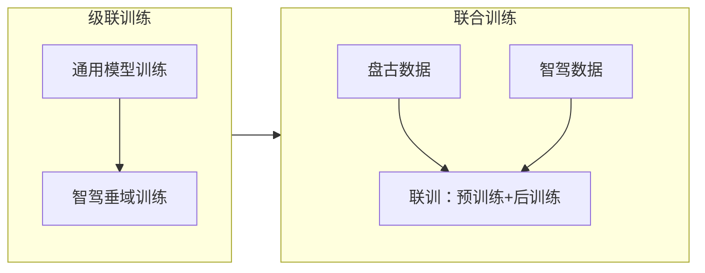

---

## 第15页 心得3-3：上下文窗口是大模型的应用瓶颈

页内文字：

- 大模型没有记忆，只有上下文
- 上下文工程的本质在减少单个 agent 的上下文负担

图表：

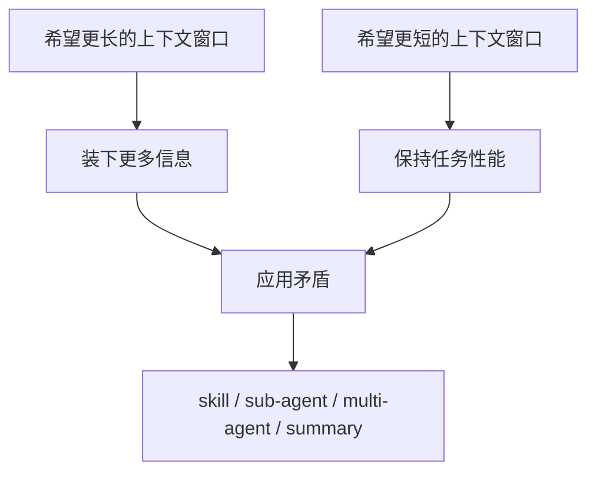

---

## 第16页 总结

文字：

- 数据是核心竞争力
- 垂域壁垒会一直存在

图表：

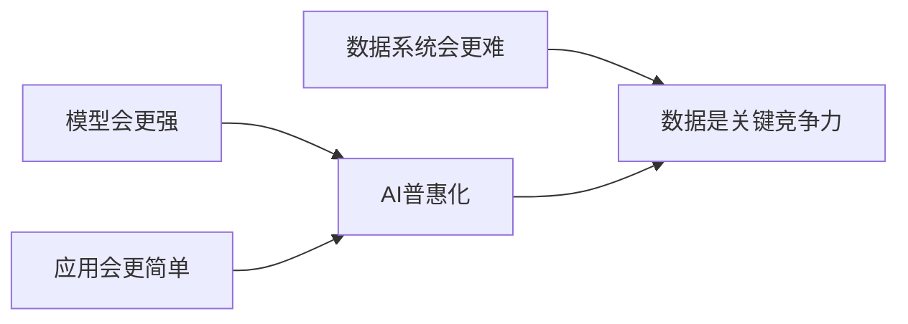

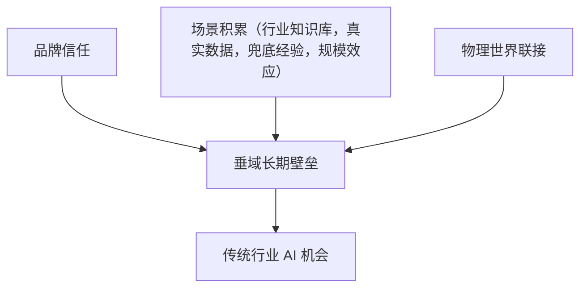

---

## 第17页 展望未来

- 中远海运 x AI，机会巨大，值得期待！
- 预祝研究院做大做强！
- ANY QUESTIONS?
